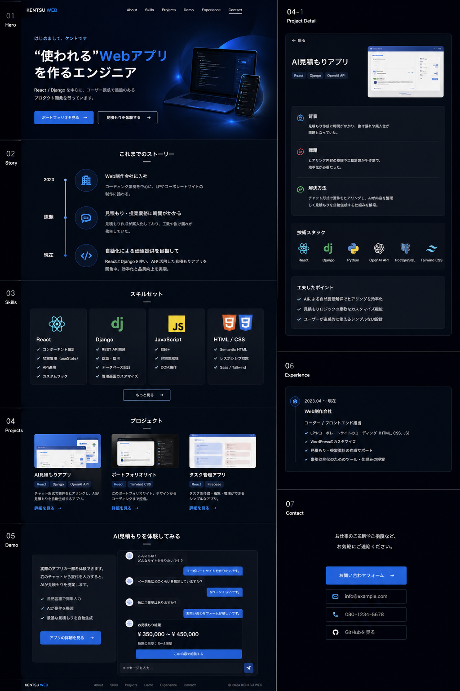

# 🚀 ポートフォリオサイト（React × Laravel）

## 🧭 概要

本ポートフォリオは、単なる制作物の紹介ではなく、
**課題解決力と実務を意識した開発力を伝えるための体験型サイト**です。

メイン機能として、**AI見積もりアプリ**を実装し、
ユーザーが実際に操作できる形でスキルを表現しています。

---

## 🎯 コンセプト

> 「ただ作るのではなく、“使われる”プロダクトを作る」

* ストーリー型ポートフォリオ
* インタラクティブなUI体験
* 実務を想定した設計・構成

---

## 🧩 主な機能

### ✨ インタラクティブポートフォリオ

* スクロール連動のストーリー表示（経歴・背景）
* スキルの動的表示（クリックで詳細表示）
* プロジェクト紹介（課題 → 解決 → 技術構成）

### 💬 AI見積もりデモ

* チャット形式UI
* 質問に回答 → 見積もり自動生成
* リアルタイム金額表示
* （今後）Laravel APIと連携予定

### 📊 職務経歴

* タイムライン形式で視覚的に表示
* 担当業務＋改善内容を明記

---

## 🖼️ デザインイメージ



※ 上記画像はデザインイメージです

---

## 🏗️ 技術構成

### フロントエンド

* React
* TypeScript
* Tailwind CSS
* Framer Motion

### バックエンド（予定）

* Laravel
* REST API

---

## 🧱 ディレクトリ構成

```bash
src/
├── components/
│   ├── Hero.tsx
│   ├── Story.tsx
│   ├── Skills.tsx
│   ├── Projects.tsx
│   ├── Demo.tsx
│   ├── Experience.tsx
│   └── Contact.tsx
├── App.tsx
└── main.tsx
```

---

## ⚙️ 開発ステップ

1. 静的UIの構築（デザイン再現）
2. コンポーネント分割
3. Tailwind CSSによるスタイリング
4. アニメーション実装（Framer Motion）
5. 見積もりロジック実装（フロント）
6. Laravel API連携

---

## 💡 こだわりポイント

* **実務課題の再現**
  → 見積もり業務の効率化をテーマに設計

* **ユーザー体験重視**
  → チャット形式で直感的に操作可能

* **拡張性のある構成**
  → フロントとバックエンドを分離

---

## 📸 デモ（予定）

* 見積もり機能の実体験
* レスポンシブ対応
* スムーズなUIアニメーション

---

## 📬 お問い合わせ

ご相談・ご連絡はお気軽にどうぞ。

* Email: [your-email@example.com](mailto:your-email@example.com)
* GitHub: https://github.com/your-username

---

## 🔥 今後の改善予定

* Laravel APIの本格連携
* 見積もり履歴の保存機能
* 管理画面（ダッシュボード）
* パフォーマンス最適化
* アクセシビリティ対応

---

## 📝 ライセンス

MIT License

---

## 🙌 最後に

本ポートフォリオは、**「実務で使える開発力」**を伝えるために制作しています。

* 課題を理解し
* ユーザー体験を設計し
* 実装まで落とし込む

その一連の流れを意識しています。

ご興味をお持ちいただけましたら、ぜひご連絡ください。
